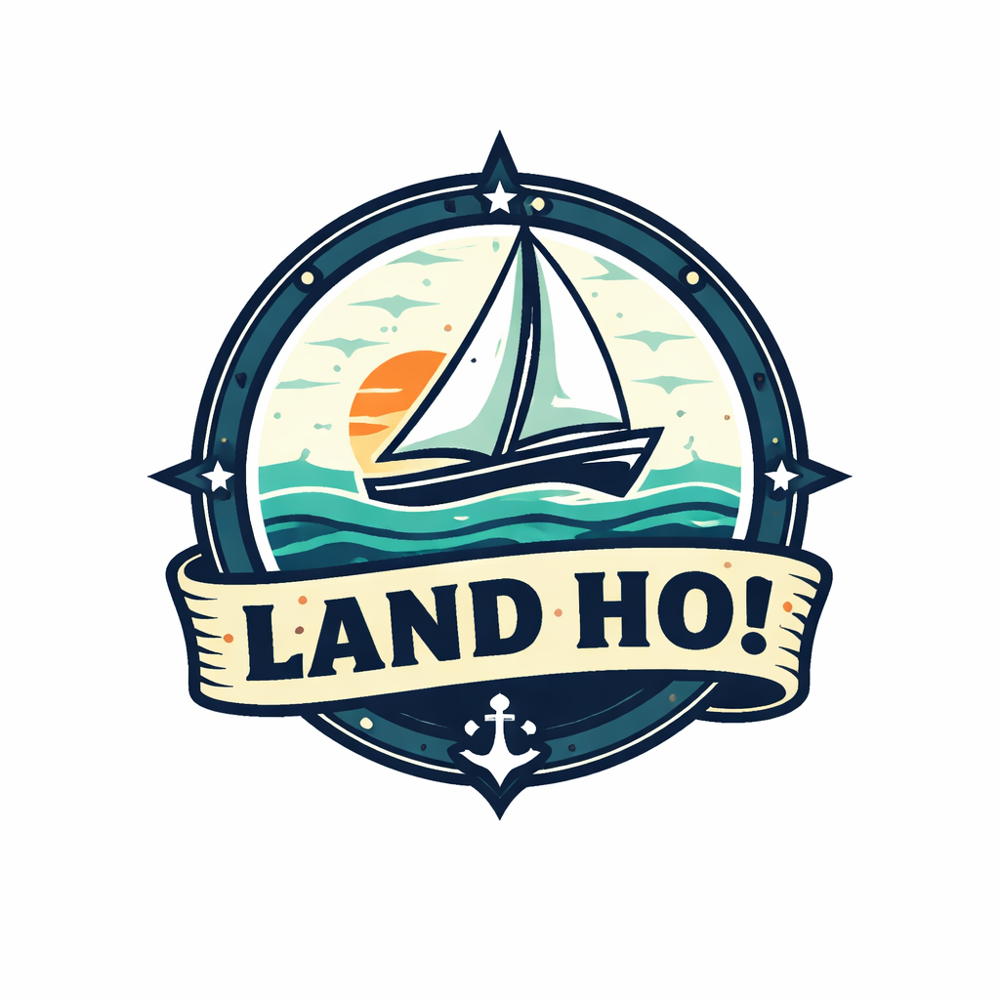

<div align="center">
  <a href="#">
    
  </a>

  <h3 align="center">Land Ho!</h3>

  <p align="center">
    A two-sided sailing marketplace connecting sailors with boat captains in Chicago.
    <br />
    <br />
    <a href="#getting-started"><strong>Get started »</strong></a>
    ·
    <a href="#known-bugs">Known Bugs</a>
    ·
    <a href="#firebase-setup">Firebase Setup</a>
  </p>
</div>

---

## About the Project

Land Ho! is a React web application that lets boat captains list their vessels for sailing trips and lets sailors browse, book, and chat with captains — like Airbnb but for Lake Michigan.

**Key features:**

- **Guest / Sailor view** — browse trips by harbor, duration, boat size, and cruise type; request bookings; message captains; request sailing instructors; take a baseline sailing-knowledge test during onboarding.
- **Host / Captain view** — complete a captain profile (license, boat info, liability waiver); publish boat listings with photos and a pinned map location; approve or reject booking requests.
- **Real-time chat** — sailors and captains message each other within a booking context.
- **Interactive map** — Mapbox-powered map view of all active listings across 14 Chicago harbors.
- **Weather widget** — live NOAA forecast for the Chicago area.

### Screenshot

> _Add a screenshot of the app here (e.g., the guest marketplace or a boat detail page)._
>
> Suggested: run `npm run dev`, take a screenshot, save it to `public/screenshot.png`, and replace this block with:
> ``

### Built With

- [React 19](https://react.dev/) + [TypeScript](https://www.typescriptlang.org/)
- [Vite](https://vitejs.dev/)
- [Firebase](https://firebase.google.com/) (Auth, Firestore, Cloud Storage, Hosting)
- [Mapbox GL JS](https://docs.mapbox.com/mapbox-gl-js/) / [react-map-gl](https://visgl.github.io/react-map-gl/)
- [React Router v7](https://reactrouter.com/)
- [Vitest](https://vitest.dev/) for testing

---

## Getting Started

### Prerequisites

- Node.js 20+ and npm
- A Firebase project (see [Firebase Setup](#firebase-setup))
- A Mapbox account (see [Mapbox Setup](#mapbox-setup)) — optional, map and geocoding features will be hidden without it

### Installation

1. Clone the repository:

   ```sh
   git clone <your-repo-url>
   cd land-ho
   ```

2. Install dependencies:

   ```sh
   npm install
   ```

3. Create your environment file by copying the example:

   ```sh
   cp .env.example .env
   ```

4. Fill in the values in `.env` (see [Firebase Setup](#firebase-setup) and [Mapbox Setup](#mapbox-setup)).

5. Start the development server:

   ```sh
   npm run dev
   ```

   The app will be available at `http://localhost:5173`.

---

## Firebase Setup

### 1. Create a Firebase Project

1. Go to [https://console.firebase.google.com](https://console.firebase.google.com) and click **Add project**.
2. Give it a name (e.g., `land-ho`), disable Google Analytics if you don't need it, and click **Create project**.

### 2. Enable Firebase Services

In the Firebase console, enable:

- **Authentication** → Sign-in method → Google (enable it).
- **Firestore Database** → Create database → start in **test mode** (you can apply the production rules later).
- **Storage** → Get started → start in test mode.

### 3. Get Your Configuration Keys

1. Go to **Project settings** (gear icon) → **General** tab.
2. Under **Your apps**, click **Add app** → Web (`</>`).
3. Register the app and copy the `firebaseConfig` object values into your `.env` file:

   ```env
   VITE_FIREBASE_API_KEY=...
   VITE_FIREBASE_AUTH_DOMAIN=...
   VITE_FIREBASE_PROJECT_ID=...
   VITE_FIREBASE_STORAGE_BUCKET=...
   VITE_FIREBASE_MESSAGING_SENDER_ID=...
   VITE_FIREBASE_APP_ID=...
   VITE_FIREBASE_MEASUREMENT_ID=...   # optional
   ```

### 4. Apply Security Rules

Deploy the included Firestore and Storage rules:

```sh
npm install -g firebase-tools
firebase login
firebase use --add   # select your project and give it the alias "default"
firebase deploy --only firestore:rules,storage
```

Or paste the contents of `firestore.rules` and `storage.rules` into the Firebase console manually.

### 5. Starting Data

All static app data (Chicago harbor names, coordinates, filter options, baseline quiz questions) lives in the source code (`src/data/constants.ts`, `src/features/onboarding/baselineQuestions.ts`). **No seed data import is required.**

Boat listings, user profiles, and booking records are created by users at runtime and are stored in Firestore automatically.

### 6. Deploy to Firebase Hosting (optional)

```sh
npm run build
firebase deploy --only hosting
```

Update `.firebaserc` to point to your project ID before deploying.

---

## Mapbox Setup

Mapbox is used for the interactive map view and location geocoding when captains create a listing.

1. Create a free account at [https://account.mapbox.com](https://account.mapbox.com).
2. Copy your **Default public token** from the Tokens page.
3. Add it to `.env`:

   ```env
   VITE_MAPBOX_ACCESS_TOKEN=REDACTEDeyJ1...
   ```

If the token is omitted, the map view and location search are hidden; all other features work normally.

---

## Running Tests

```sh
npm test              # run all tests once
npm run test:watch    # watch mode
npm run test:coverage # generate coverage report
```

Tests live in `src/test/` and cover booking logic, chat ID generation, instructor request validation, and string formatters.

---

## Project Structure

```
src/
├── App.tsx                    # Root routing and main page state
├── components/                # Shared UI components (Header, HostDashboard, GuestMarketplace, …)
├── pages/                     # Route-level pages (BoatDetailPage, ChatPage, CaptainSetupPage, …)
├── features/                  # Business logic / Firestore API modules
│   ├── boats/                 # Boat CRUD and real-time subscription
│   ├── booking/               # Booking request lifecycle
│   ├── chat/                  # Real-time messaging
│   ├── instructor/            # Instructor request matching
│   ├── onboarding/            # Captain and sailor onboarding flows
│   ├── users/                 # Public user profiles
│   └── weather/               # NOAA weather API
├── hooks/                     # Custom React hooks (useAuth, useBoats, useBoatForm, …)
├── lib/                       # Firebase initialization, Storage helpers
├── data/constants.ts          # Harbor coordinates, filter options
└── types/index.ts             # Shared TypeScript interfaces
```

---

## Known Bugs

- **Chunk size warning** — The production build produces a `mapbox-gl` chunk exceeding 500 KB. Performance on slow connections may be affected. Lazy-loading the map view would fix this.
- **Captain gate race condition** — After signing in for the first time and being redirected to `/setup/captain`, navigating back to the home page before completing setup may briefly show the host dashboard before the captain-profile check resolves.
- **No pagination** — The boat marketplace loads all published listings at once from Firestore. With many listings this will slow down initial load.
- **Instructor request status** — Once an instructor is matched to a request, there is no UI to cancel or update the match on either side.
- **Chat notifications** — There is no push notification or badge count for unread messages; users must open the chat page to check for new messages.

---

## License

Distributed under the MIT License.
